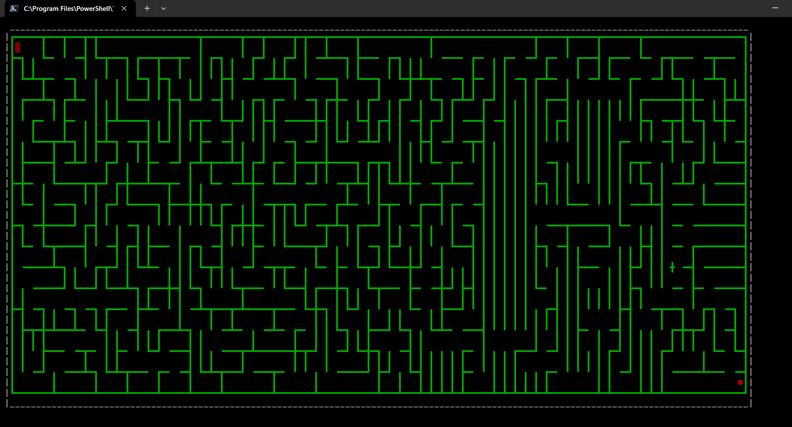

# Console Game Framework (C++)

A **console-based game framework built completely from scratch in C++**, without using any external libraries or engines.

## Features
- Pure C++ implementation
- Custom game loop and timing system
- Grid-based rendering
- Manual input handling
- Modular design for multiple games

## Games Built

### Game of Life
- Complete implementation of Conway’s Game of Life
- Efficient state updates and board swapping
- Interactive draw feature to create and experiment with patterns

### Ever-Changing Maze
- Does **not** use DFS
- Uses a custom **Origin Shift Algorithm**
- Faster than DFS-based maze generation
- Generates a unique maze on every run

## Learnings
- Building a game framework from scratch
- Memory and state management
- Game loop and timing control
- Grid-based algorithms and optimization
- Designing custom algorithms

Both the **framework and games** were built entirely from scratch to understand low-level game development in C++.
